# Ikawa — an offline coffee-farm "yield detective"

**Small AI for Development Hackathon · Agriculture track · Hack-Nation × World Bank Youth Summit, 3–4 October 2026**

Ikawa helps a smallholder coffee farmer answer the question she actually has, *"why did my yield drop, and what should I do this week?"*, instead of just *"what disease is on this leaf?"*. From a few leaf photos, the rain and soil for her area, and six simple questions, it ranks the likely causes, plays **one** action card as audio in her language, and, whenever the evidence is thin, says **"I cannot read this / I'm not sure — a person will help"** and packs the case into **one SMS** for the extension officer. It runs **fully offline** on a low-end Android phone. **A person always makes the final call.**

| | |
|---|---|
| **Live app** | **[ikawa-meek-0s-projects.vercel.app](https://ikawa-meek-0s-projects.vercel.app)** — works offline after the first visit; installable on Android |
| **Try it in 1 minute** | ▶ [Demo: leaf-rust case](https://ikawa-meek-0s-projects.vercel.app/?demo=1) · ▶ [Demo: "cannot read this leaf" case](https://ikawa-meek-0s-projects.vercel.app/?demo=1&run=mite) · see [all links](#links) |
| **Code** | [github.com/mehedi37/Ikawa](https://github.com/mehedi37/Ikawa) |
| **Videos** | Product demo: *link added after upload* · Technical walkthrough: *link added after upload* |
| **Setting** | Kirinyaga county, Kenya (Mutira ward, ≈ −0.47°, 37.23°) |
| **Language** | Kiswahili (**machine-drafted, not yet checked by a native speaker**) with English fallback; adding a language = adding a pack |
| **Status** | Deployed working prototype · 102 unit tests + 14 browser tests (incl. an offline test) pass locally **and against the live URL** · Lighthouse (mobile): accessibility 100, performance 83 |

> **Noor** is the persona from the hackathon brief: two hectares of coffee, a basic phone that stays at the house while she works the slope, her daughter's smartphone at weekends, and an extension officer who visits "twice a year at best". *Ikawa* means coffee in several East African languages.

<p align="center">
  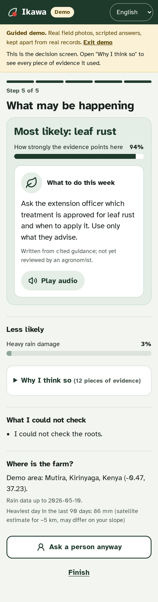
  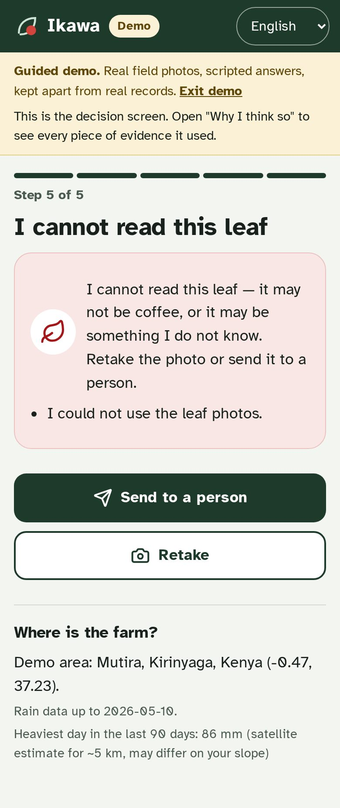
  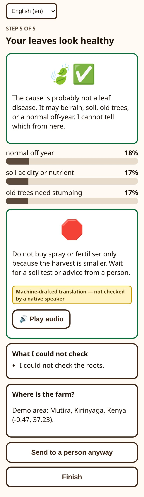
</p>

## Links

**The app** (open on a phone for the real experience; on a laptop it renders in a phone-width column)

| What | Link | What you will see |
|---|---|---|
| Live app | [ikawa-meek-0s-projects.vercel.app](https://ikawa-meek-0s-projects.vercel.app) | PIN screen → home. On the first visit choose any PIN of 4+ digits (it encrypts the data on *that* device); later visits on the same device need the same PIN |
| Demo: leaf-rust case | [`/?demo=1`](https://ikawa-meek-0s-projects.vercel.app/?demo=1) | A scripted case with real leaf photos, ending on a ranked result + one action card |
| Demo: "cannot read" case | [`/?demo=1&run=mite`](https://ikawa-meek-0s-projects.vercel.app/?demo=1&run=mite) | Mite-damaged leaves → *"I cannot read this leaf"* → one-SMS escalation |
| Officer page | [`/#/officer`](https://ikawa-meek-0s-projects.vercel.app/#/officer) | Paste a case SMS, read it decoded, reply with a card code |
| Cooperative page | [`/#/coop`](https://ikawa-meek-0s-projects.vercel.app/#/coop) | Stored cases, storage used, export |
| Health / version | [`/health.json`](https://ikawa-meek-0s-projects.vercel.app/health.json) | Commit, build time, model SHA-256, data versions |

**Project**

| What | Link |
|---|---|
| Source code | [github.com/mehedi37/Ikawa](https://github.com/mehedi37/Ikawa) |
| Video 1 — product demo | *link added after upload* |
| Video 2 — technical walkthrough | *link added after upload* |
| Measured results (all runs) | [`docs/evidence/README.md`](docs/evidence/README.md) |
| Decision log | [`docs/decisions.md`](docs/decisions.md) |
| Verified problem facts | [`docs/problem-evidence.md`](docs/problem-evidence.md) |
| Slides (PNG) | [`docs/slides/png/`](docs/slides/png/) |

**Data and evidence sources**

| Source | Link |
|---|---|
| JMuBEN (Arabica leaves, Kirinyaga, Kenya) | [Mendeley t2r6rszp5c](https://data.mendeley.com/datasets/t2r6rszp5c/1) |
| JMuBEN2 (healthy + leaf miner) | [Mendeley tgv3zb82nd](https://data.mendeley.com/datasets/tgv3zb82nd/1) |
| BRACOL (Arabica leaves, Brazil) | [Mendeley yy2k5y8mxg](https://data.mendeley.com/datasets/yy2k5y8mxg/1) |
| RoCoLe (Robusta leaves, Ecuador) | [Mendeley c5yvn32dzg](https://data.mendeley.com/datasets/c5yvn32dzg/2) |
| PlantVillage | [Kaggle](https://www.kaggle.com/datasets/abdallahalidev/plantvillage-dataset) |
| Cassava Leaf Disease | [Kaggle competition](https://www.kaggle.com/c/cassava-leaf-disease-classification) |
| CHIRPS daily rainfall | [UCSB Climate Hazards Center](https://www.chc.ucsb.edu/data/chirps) |
| NASA POWER | [power.larc.nasa.gov](https://power.larc.nasa.gov/) |
| iSDAsoil | [isda-africa.com/isdasoil](https://www.isda-africa.com/isdasoil/) |
| WFP food prices, Kenya | [HDX](https://data.humdata.org/dataset/wfp-food-prices-for-kenya) |
| FAOSTAT | [fao.org/faostat](https://www.fao.org/faostat) |
| Kenya Agricultural Sector Extension Policy (2023) | [kilimo.go.ke (PDF)](https://kilimo.go.ke/wp-content/uploads/2024/10/KENYA-AGRICULTURAL-SECTOR-EXTENSION-POLICY-2023.pdf) |

**Models and tools**

| Tool | Link |
|---|---|
| Meta NLLB-200 (translation, used at build time) | [Hugging Face](https://huggingface.co/facebook/nllb-200-distilled-600M) |
| Meta MMS-TTS Kiswahili (speech, used at build time) | [Hugging Face](https://huggingface.co/facebook/mms-tts-swh) |
| ONNX Runtime Web (on-device inference) | [onnxruntime.ai](https://onnxruntime.ai/docs/tutorials/web/) |

The Kaggle notebooks used for data preparation and training are private; the same scripts are in [`ml/`](ml/) and run unchanged on Kaggle or locally.

**Event**

| | |
|---|---|
| Hack-Nation | [hack-nation.ai](https://hack-nation.ai) |
| World Bank Global AI & Digital Summit 2026 (Seoul) | [worldbank.org event page](https://www.worldbank.org/en/events/2026/10/19/global-ai-and-digital-summit-2026) |

---

## Contents
[Links](#links) · 1. [The problem](#1-the-problem) · 2. [Who it is for](#2-who-it-is-for) · 3. [How it works — the journey](#3-how-it-works--the-journey) · 4. [Screenshots](#4-screenshots) · 5. [The AI, and where we chose not to use it](#5-the-ai-and-where-we-chose-not-to-use-it) · 6. [Guardrails](#6-guardrails-and-responsible-ai) · 7. [Results](#7-results-measured) · 8. [Honest limits](#8-honest-limits) · 9. [Data](#9-data) · 10. [Languages](#10-languages-and-localisation) · 11. [How it meets the brief](#11-how-it-meets-the-brief) · 12. [Architecture](#12-architecture) · 13. [Run it](#13-run-it) · 14. [Deployment](#14-deployment-health-and-storage) · 15. [Business model](#15-business-model-why-it-can-last) · 16. [Roadmap](#16-status-and-roadmap) · 17. [Docs map](#17-documentation-map) · 18. [Credits](#18-credits-and-licences)

---

## 1. The problem

> **Because of Ikawa, a smallholder coffee farmer in Kirinyaga will identify the most likely cause of her falling yield, and choose one action (or send the case to an extension officer) within the same week she notices the problem, a decision she would otherwise make late or by guesswork; we know because Kenya's coffee yield was 435 kg/ha in 2023 against 592 kg/ha in 2000 (FAOSTAT), and Kenya's 2023 extension policy states that the extension-staff-to-farmer ratio "has not improved" and targets one officer per 600 farmers by 2029.**

| Verified fact | Value | Source |
|---|---|---|
| Kenya green-coffee yield | **592 kg/ha (2000) → 262 kg/ha (2010) → 435 kg/ha (2023)** | FAOSTAT bulk file, computed by us |
| Coffee area harvested | 160,000 ha (2010) → 111,900 ha (2023) | FAOSTAT |
| Extension coverage | "the ratio of extension staff to farmer has not improved"; target 1 : 600 by 2029 | *Kenya Agricultural Sector Extension Policy*, Dec 2023, p. 8 |

These facts do **not** prove that missing advice caused the yield fall (prices, weather, tree age and disease all matter). They show why faster, structured decision support is worth building. Details, and the second-hand figures we chose *not* to use: [`docs/problem-evidence.md`](docs/problem-evidence.md).

**The insight.** Most crop apps answer "what is on this leaf?". Noor's real question is "why did my yield drop?", and sometimes the most valuable answer is *"part of this is a normal off-year — don't buy anything."* So Ikawa is a **detective, not a classifier**.

## 2. Who it is for

| Person | Device | Role |
|---|---|---|
| **Noor**, the farmer | Basic phone (calls, SMS, mobile money) | Collects leaves, answers questions (voice or tap), gets the result and the officer's reply by SMS, **makes the decision** |
| **Agent**: her daughter at weekends, or a cooperative youth agent | Low-end Android smartphone | Runs Ikawa offline: photographs leaves, plays questions, shows the result |
| **Extension officer** | Any phone | Receives escalated cases as one SMS; replies with a card code (e.g. `A07`) |
| **Cooperative** | Laptop/phone, occasional internet | Receives consented farmer records — the registry the brief says is missing |

## 3. How it works — the journey


The two bags are a control group: if the worst-row leaves look no sicker than the good-row leaves, the leaves are probably **not** the cause, and the detective shifts weight toward soil, rain, old trees or a normal off-year.

## 4. Screenshots

All captured from the live site on a 390×844 phone viewport. More in [`docs/screenshots/`](docs/screenshots/).

| | | |
|:-:|:-:|:-:|
| 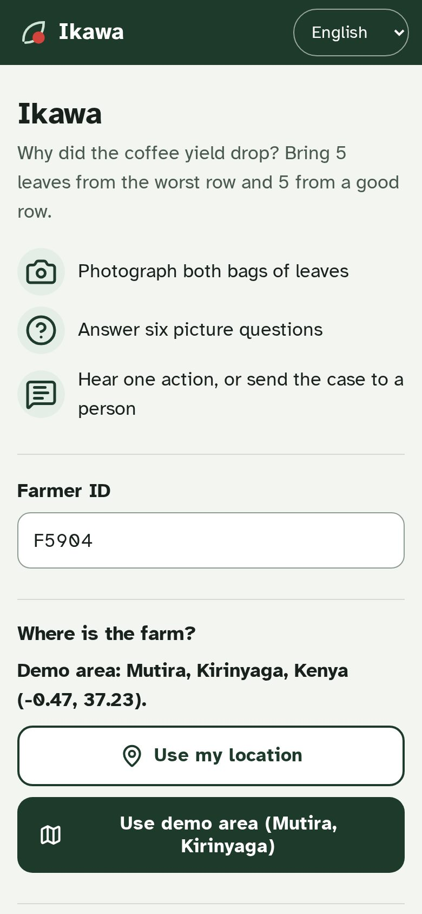<br/>**Home** — area, language, demo runs | 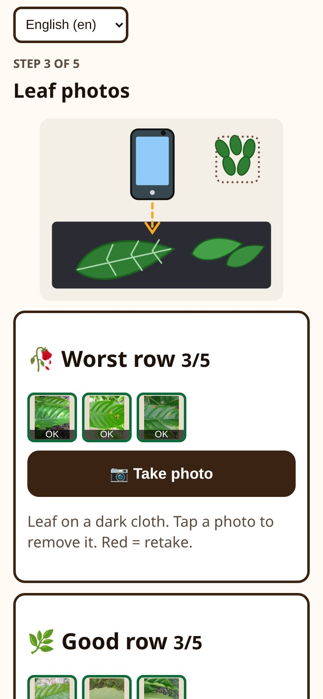<br/>**Two bags** — worst row vs good row | 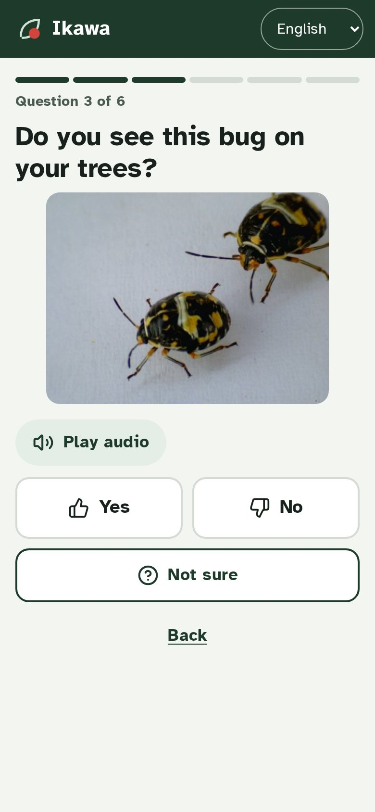<br/>**Picture questions** — voice or tap |
| <br/>**Result** — ranked causes + one action | <br/>**"I cannot read this leaf"** | 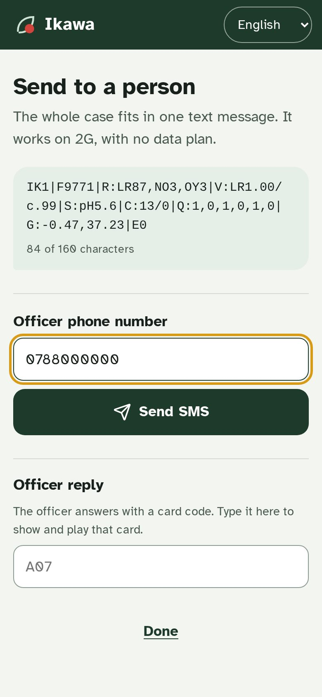<br/>**One SMS** to the officer |
| 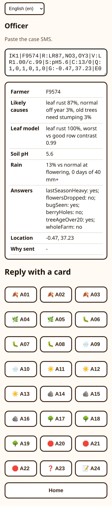<br/>**Officer page** — decode, reply | 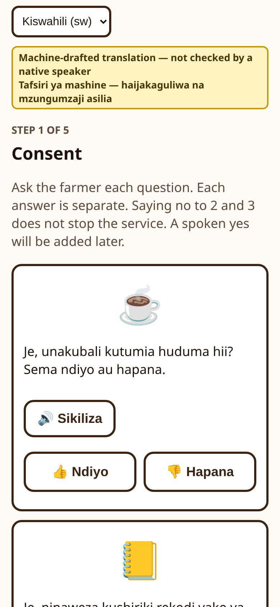<br/>**Kiswahili** — machine-drafted badge | 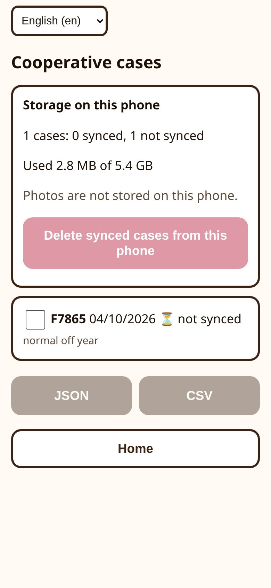<br/>**Coop page** — cases, storage |

## 5. The AI, and where we chose not to use it

**Design rule:** every AI output is a choice from a **closed list with a probability**, and below a threshold the only allowed answer is *"not sure — ask a person"*. Nothing is generated at run time, so nothing can be hallucinated.

| Part | Technique | What it does | Size / speed |
|---|---|---|---|
| **Leaf vision** | Computer vision: MobileNetV2, fine-tuned, temperature-calibrated, **int8** ONNX | 6 classes: `healthy`, `leaf_rust`, `cercospora`, `phoma`, `leaf_miner`, and `not_coffee` = **"I cannot read this leaf"** (not coffee, or a condition outside the five) | **2.4 MB**; ≈ 0.27 s per photo on a 4× throttled laptop CPU |
| **Voice answers** | Pattern recognition: MFCC features + dynamic time warping against the farmer's **own** recorded words | Recognises yes / no / not sure; tap fallback always on screen | **0 MB of model**; works in **any** language, even unwritten ones |
| **The detective** | Probabilistic reasoning: hand-built Bayesian scorer | Combines leaf results (+ worst-vs-good contrast), heavy-rain days, flowering-season rain, soil pH and six answers into probabilities over 9 causes | Instant; every factor inspectable |
| **Abstain rules** | Thresholds | Abstains if: photo unusable · vision < 0.60 · top cause < 0.45 · top two within 0.15 · answers contradict · top cause is `unknown` · **money-costing advice < 0.75** | — |

The 9 causes: leaf rust · other leaf disease · insect pest · heavy-rain damage · drought at flowering · soil acidity/nutrients · old trees needing stumping · **normal off-year** · unknown.

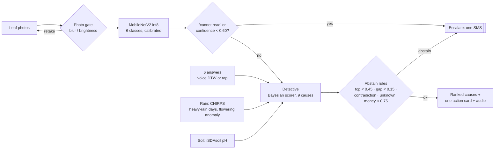

**Where we chose not to use AI** (the brief asks "would a simpler tool do the same job?"):

| Feature | Tool | Why |
|---|---|---|
| Photo quality | Plain rules (variance of Laplacian, brightness) | Rules are enough |
| Escalation | One SMS, no server | Works on 2G with no data plan |
| Price reference | Plain lookup of WFP maize/bean prices (**no coffee price exists** in the WFP files for Kenya or Rwanda — we checked) | An SMS-level problem deserves an SMS-level tool |
| Advice text | A fixed list of 24 cards written from cited guidance | The tool can only say checked things |

What AI adds that SMS, a spreadsheet or a search cannot: reading a leaf photo, and weighing several possible causes against *her* rain, soil and answers.

## 6. Guardrails and responsible AI

| Concern | What Ikawa does |
|---|---|
| Human in the loop | Suggests, never acts. Money-costing advice needs ≥ 0.75 confidence **or** an officer. |
| Hallucination | Closed lists; pre-recorded audio; no generative text at run time |
| Fail-safe | 7 abstain rules + the "cannot read this leaf" class → one SMS → officer reply code |
| Consent | Three separate consents. The photo consent is labelled honestly: *"not used yet: this version keeps no photos."* |
| Data on the phone | IndexedDB encrypted with AES-GCM (key from the agent's PIN via PBKDF2); coordinates rounded to ~1 km; cases deleted only after the agent marks them synced |
| Shared / lost phone | PIN-gated, encrypted storage *(adopted voluntarily — this question is in the brief's Health annex)* |
| Bias | Trained on Kenyan, Brazilian and Ecuadorian leaves; none from Kirinyaga phones (stated). Voice works per speaker in any language. The registry records the woman farmer in her own name. |
| Language honesty | Machine-drafted Kiswahili is labelled in the app and in the videos |

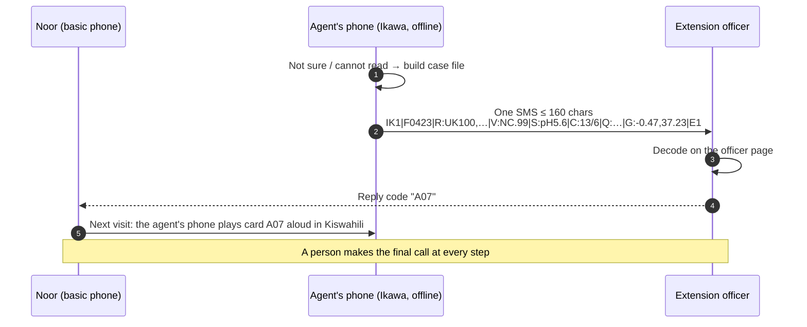

## 7. Results (measured)

All numbers come from files in [`docs/evidence/`](docs/evidence/README.md). Nothing was tuned on the held-out sets.

| Run | What changed | In-distribution test | **Held-out field clusters** (RoCoLe C9–C12) | **Unseen mite photos** |
|---|---|---|---|---|
| 1 | Baseline (RoCoLe held out entirely) | 98.96 % | **0.0 %** — every field photo labelled "not coffee" (a background shortcut) | 97 % confident, wrong |
| 2 | RoCoLe split by whole field cluster + low-res augmentation | 98.44 % | **96.6 %** | only 2.6 % flagged |
| **3 (shipped)** | Mite photos taught as "cannot read" | **98.51 %** | 89.2 % of all leaves; **96.6 % when it answers**; declines 7.6 % | **50 % flagged** (23/46) |
| 4 | Same as 3 with EfficientNet-Lite0 (pre-registered comparison) | 98.81 % | 89.7 % | 34.8 % flagged → **not adopted** (+0.04 pts on validation < the +0.5 rule written in advance; worse on unknown pests; 50 % larger) |

| Shipped phone model | Value |
|---|---|
| Architecture / format | MobileNetV2-1.0 → ONNX → static int8 (best of 3 recipes, chosen by measured accuracy) |
| Size | **2.4 MB** (fp32: 8.9 MB) |
| Accuracy after int8 | test 98.67 % = fp32 98.67 %; field clusters 88.7 % vs 89.2 %; 98–100 % identical predictions |
| Calibration | ECE 0.019 (test); temperature 0.67 |
| Speed (4× CPU throttle) | model load + 6 photos 3.1 s; one photo ≈ 0.27 s |
| One-time install | ≈ 17 MB cached for offline use (13.6 MB of it is the ONNX Runtime WebAssembly engine) |

Two uncomfortable findings we kept:
1. **The most-used coffee leaf dataset is 98 % copies.** JMuBEN's 58,550 files collapse to **1,082 independent image groups**; its "healthy" class has **63 distinct files**, each stored ~300 times. A random split would have reported fake accuracy, so we split by group.
2. **Our first model was 0 % accurate on real field photos** while scoring 98.96 % on its own test set. We kept the run as evidence and fixed the cause.

The detective is stable where evidence is clear (0 % top-cause flips under ±20 % changes to every factor) and unstable where it is ambiguous (40–62 % flips), which is exactly where it abstains.

## 8. Honest limits

1. **No Kenyan phone photos** in training. The held-out field clusters share the camera, species (Robusta) and field with the training clusters: a within-dataset test, not a country shift.
2. **Five leaf conditions only.** Roots, stems, berries and nutrient deficiency are invisible. **Half of unseen mite photos are still read as rust.**
3. **Small test sets:** healthy n = 35 (in-distribution), 46 unseen mite photos.
4. **The detective's multipliers are expert guesses** (`UNVERIFIED-expert-guess` in [`app/src/engine/priors.ts`](app/src/engine/priors.ts)); only their *directions* are backed by sources.
5. **Rain is a ~5 km satellite estimate** (CHIRPS) and cannot see one slope; soil values are predicted (iSDAsoil), not lab-measured.
6. **Kiswahili is machine-drafted** (Meta NLLB-200 + manual fixes by a non-native speaker) and **unreviewed**; the audio is Meta MMS-TTS (non-commercial licence).
7. One held-out healthy photo is read as "cannot read" with 0.99 confidence; in a 5-leaf bag it can turn "your leaves look healthy" into "not sure". Safe, but over-cautious.
8. The nearest WFP market price (Karatina, 11 km) was last updated in June 2024 and is flagged as stale in the app.

## 9. Data

| Dataset | Used for | Licence | Size used | Notes |
|---|---|---|---|---|
| **JMuBEN + JMuBEN2** (Arabica, Kirinyaga, Kenya) | Training (5 leaf classes) | CC BY 4.0 | 58,550 files → **1,082 groups** | 98 % copies; SHA-256-verified downloads from Mendeley |
| **BRACOL** (Arabica, Brazil) | Training + test | CC BY 4.0 | 1,343 images | Official zip is **truncated upstream**: 1,402 of 1,747 recoverable |
| **RoCoLe** (Robusta, Ecuador, smartphone, field) | Train C1–7, val C8, **held-out C9–12** | CC BY 4.0 | 1,477 images | Mite photos used for "cannot read" and the abstention test |
| PlantVillage (non-coffee subset) | "cannot read" class | see source | 1,976 | Studio images |
| Cassava Leaf Disease (Kaggle competition) | "cannot read" class | competition terms | 2,000 | Field photos |
| **CHIRPS v2.0** daily rain, 0.05° | Heavy-rain days per area and date | see source | 2025 + 2026 (to 31 Aug) | Real events: up to 134 mm in one day somewhere in the study area (28 Apr 2026); 86 mm at the Mutira demo cell in the 90 days to 10 May 2026 |
| NASA POWER | Flowering-season rain anomaly | open | 2015–2026 | ~50 km: too coarse for heavy-rain days |
| **iSDAsoil** (30 m) | Topsoil pH per area | CC BY 4.0 | 49 points | Predicted values |
| WFP food prices (HDX), Kenya | Maize/bean price card | see source | 46 series within 150 km | Nearest: Karatina (11 km), stale since Jun 2024 |
| FAOSTAT | Problem evidence | see source | — | — |

"See source" means we did not re-check the licence ourselves. More: [`docs/data-access.md`](docs/data-access.md).

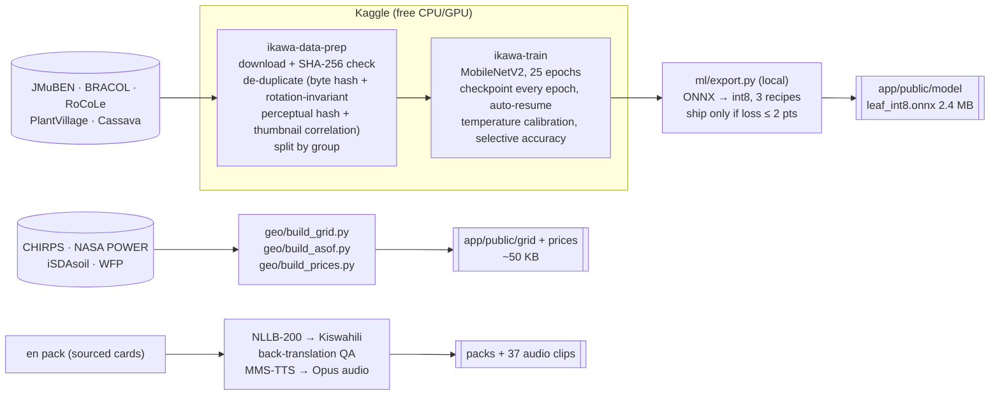

## 10. Languages and localisation

- **One pack per language:** `app/src/content/packs/<lang>.json` (24 action cards, questions, consent and UI strings) + audio in `app/public/audio/`.
- **Kiswahili** was drafted with Meta **NLLB-200** running locally, checked by back-translation, and clear errors fixed by hand (e.g. "sick leaves" had become "patients' papers", and "leaf" had become "paper"). Every fix is listed in the pack's `manualEdits`. **No string is marked as reviewed.**
- **Adding a language** (e.g. Gikuyu, `kik_Latn`) needs no code: `ml/translate_content.py` / `ml/translate_missing.py`, then `audio/render.py` (Meta MMS-TTS supports `kik`), then add it to the switcher. Voice answers already work in any language.
- **Native review kit:** [`docs/review/`](docs/review/) — every string, safety-critical lines first, plus a message for a volunteer reviewer.

## 11. How it meets the brief

| Rule in the brief (§06 and Annex B) | How Ikawa meets it |
|---|---|
| Runs on a device the user already has | Low-end Android phone (agent/daughter) + Noor's basic phone by SMS |
| Core feature works offline | Model, rain/soil grid, detective and audio all on the phone; proven by [`app/e2e/offline.spec.ts`](app/e2e/offline.spec.ts) |
| Model small enough to side-load / send over a weak link | 2.4 MB model; data + audio < 1 MB |
| At least one interaction in a named local language | **Kiswahili**: audio questions, audio action cards, SMS text |
| "How would it fare in a less-supported language?" | Voice templates need no language data; packs are files; Gikuyu is the next pack |
| A person makes the final call; flags what it is unsure of | Suggest-only; probabilities; "what I could not check"; abstain rules |
| Avoid hallucinations | Closed lists, pre-recorded audio |
| Cite data; state what the data does not cover | §9 and §8 |
| Help Noor make or act on one better agricultural decision | Identify a crop problem, time an action, localised advice, document an observation, connect to the extension next step |
| Precondition: farmer registry | Each consented case creates a registry record in the woman farmer's own name |

## 12. Architecture

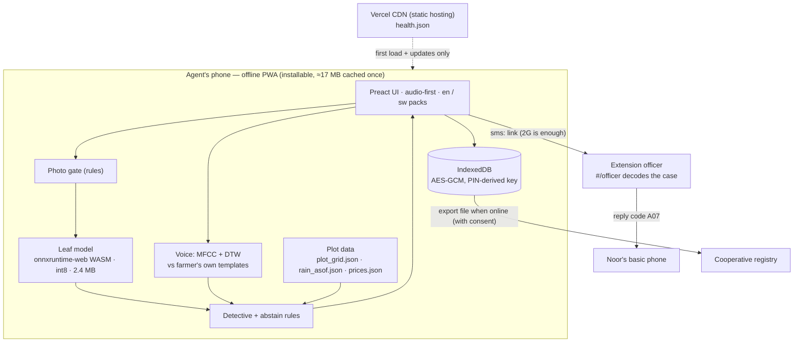

```
app/            PWA: src/screens · src/engine (vision, detective, priors, voice, smscodec, photogate)
                src/lib (analyze, plot, voicecodec) · src/content/packs (en, sw) · src/store (encrypted IndexedDB)
                e2e/ (Playwright) · public/ (model, grid, prices, audio, img, demo)
ml/             prepare_data.py · train.py · export.py · translate_content.py · translate_missing.py · kaggle/
geo/            build_grid.py · build_asof.py · build_prices.py · test_geo.py
detective/      vignettes.json (30 SYNTHETIC test cases)        audio/  render.py (MMS-TTS → Opus)
data/scripts/   fetch_open_data.py            scripts/  healthcheck.sh
docs/           evidence · decisions · problem evidence · contracts · slides · screenshots · review kit
```

**Stack:** TypeScript, Preact, Vite, vite-plugin-pwa (Workbox), onnxruntime-web, Meyda, idb, WebCrypto · Python, PyTorch, timm, ONNX Runtime quantisation, rasterio, NLLB-200, MMS-TTS · Kaggle kernels · Vitest, Playwright · Vercel.

## 13. Run it

### The app
```bash
cd app
npm install
npm run dev                      # http://localhost:5173   demo: /?demo=1   cannot-read demo: /?demo=1&run=mite
npm test                         # 102 unit tests (vitest)
npm run typecheck                # app + tests
npx playwright install chromium  # once
npx playwright test              # 14 browser tests, incl. the offline proof
LIVE_URL=https://ikawa-meek-0s-projects.vercel.app npx playwright test -c playwright.live.config.ts   # same tests against the live site
npm run build && npm run size    # production build + size budget check
```
Routes: `#/officer` (decode a case SMS, reply with a card code), `#/coop` (stored cases, storage, export).

### Rebuild the data and the model (optional)
```bash
uv sync
uv run python data/scripts/fetch_open_data.py             # CHIRPS, NASA POWER, iSDAsoil, WFP, FAOSTAT (idempotent)
uv run python geo/build_grid.py && uv run python geo/build_asof.py && uv run python geo/build_prices.py

# Kaggle (needs KAGGLE_API_TOKEN in a git-ignored .env)
ml/kaggle/push.sh data-prep      # download + verify + de-duplicate + split → images.tar + manifest.csv
ml/kaggle/push.sh train          # MobileNetV2, 25 epochs, checkpoint every epoch, auto-resume

# Phone model (needs torch, timm, onnx, onnxruntime)
python ml/export.py --run <train output> --data <data-prep output> --out app/public/model --calib 100
```
Training is crash-safe: `last.pt` is written atomically after every epoch and on SIGTERM, the last three epochs are kept, and `--resume auto` continues from the newest readable checkpoint. A hard-kill test lost at most one epoch, and the resumed run reproduced identical numbers.

## 14. Deployment, health and storage

**Live: https://ikawa-meek-0s-projects.vercel.app** (Vercel). `ikawa.vercel.app` belongs to someone else.

Ikawa is a **static PWA**: no backend, no database, no API keys at run time. It needs only HTTPS (camera, microphone, GPS and the service worker need a secure context).

| | **Vercel (live)** | **Render (optional mirror, not deployed)** |
|---|---|---|
| Config | [`app/vercel.json`](app/vercel.json) + [`app/.vercelignore`](app/.vercelignore) | [`render.yaml`](render.yaml) (Blueprint, static site) |
| Build | root `app` · `npm ci` · `npm run build` · output `dist` | same |
| Headers | `sw.js`, `registerSW.js`, `manifest.webmanifest`: `no-cache` (updates reach phones) · `health.json`: `no-store` · `/assets/*`: immutable · `Permissions-Policy` for camera/mic/GPS · `nosniff` · `no-referrer` | same |

```bash
cd app && vercel deploy --prod --yes --build-env GIT_COMMIT=$(git rev-parse --short HEAD)
../scripts/healthcheck.sh https://ikawa-meek-0s-projects.vercel.app      # exit 0 = healthy
```

**Health and uptime.** `GET /health.json` returns the commit, build time, model file + SHA-256, data versions and language-pack status; it is written *after* the build, so it is never served from the offline cache. [`scripts/healthcheck.sh`](scripts/healthcheck.sh) checks the page, `health.json`, the model, the grids, the service worker, and that the WebAssembly engine is served as `application/wasm`. **No keep-alive cron is needed:** static hosting on Vercel's CDN (or a Render *static site*) never sleeps — only server processes spin down, and Ikawa has none.

**Does the app grow on the phone?** No photos are stored and the model never changes on the device.

| What | Size | Grows? |
|---|---|---|
| Offline cache (app, model, engine, grids, audio) | ≈ 17 MB | **No** — fixed per release; a new deploy replaces changed files and deletes old caches |
| Each case (causes, answers, area; encrypted) | ≈ 1–2 KB | Until the agent marks it synced and deletes it (Coop page) |
| Each farmer's voice templates (numbers, not audio) | ≈ 42 KB (was 150 KB) | Once per farmer |
| Photos | 0 | Never stored |

## 15. Business model: why it can last

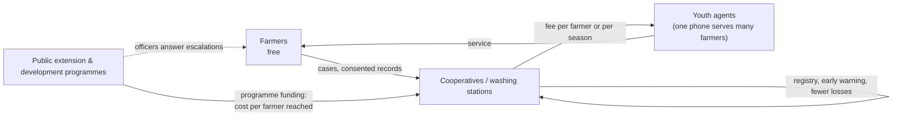

- **Free for farmers.** The people who benefit from scale pay: cooperatives (a farmer registry, earlier warning of disease, better-quality cherries) and public extension or development programmes (cost per farmer reached is far below a physical visit).
- **Jobs:** one trained youth agent with one phone serves many farmers — the brief's youth-employment theme.
- **Cheap to run:** no servers or cloud AI; the cost is human (agents and officers), which is the right shape for a development tool.
- **Replicable:** a new crop = retrain the leaf model on the same pipeline; a new region = rebuild the rain/soil grid; a new language = a new pack.
- Full plan (written before the build, partly superseded): [`docs/business-plan.md`](docs/business-plan.md).

## 16. Status and roadmap

**Done:** data pipeline · 4 training runs with evidence · int8 phone model · detective + abstain rules · voice templates · SMS codec · encrypted store · Kirinyaga rain/soil grid with per-date history · Kenyan market prices · Kiswahili pack + 37 audio clips · licensed pictures · offline proof · "leaves look healthy" state · demo mode · deployment + health check.

**Next:**
- Native-speaker review of Kiswahili; a Gikuyu pack
- Kenyan phone photos from a partner cooperative (with consent); retrain and re-test
- A 7th `other_damage` class and an out-of-distribution score, to catch the mites that still pass
- Agronomist review of every detective factor (replace `UNVERIFIED` values)
- Smaller runtime (custom minimal ONNX Runtime build or WebNN); optional multi-threaded WASM
- Re-use saved voice templates on a farmer's next visit
- Registry export into existing systems; an aggregated "rust radar" early-warning map

## 17. Documentation map

| File | What |
|---|---|
| [`docs/evidence/README.md`](docs/evidence/README.md) | Measured results of every run |
| [`docs/decisions.md`](docs/decisions.md) | Decision log D-001…D-032 with reasons and rejected options |
| [`docs/problem-evidence.md`](docs/problem-evidence.md) | Verified problem facts + the problem statement |
| [`docs/contracts.md`](docs/contracts.md) | Locked interfaces between modules |
| [`docs/build-details.md`](docs/build-details.md) · [`docs/business-plan.md`](docs/business-plan.md) · [`docs/tech-stack.md`](docs/tech-stack.md) | Original design, business plan, stack (partly superseded — see banners) |
| [`docs/data-access.md`](docs/data-access.md) · [`docs/content-sources.md`](docs/content-sources.md) · [`docs/ATTRIBUTIONS.md`](docs/ATTRIBUTIONS.md) | Data access, advice sources, image credits |
| [`docs/slides/`](docs/slides/) · [`docs/screenshots/`](docs/screenshots/) · [`docs/review/`](docs/review/) | Video slides, live screenshots, native-review kit |
| [`app/qa/REPORT.md`](app/qa/REPORT.md) | Browser QA report |

## 18. Credits and licences

- **Datasets:** JMuBEN/JMuBEN2, BRACOL and RoCoLe (CC BY 4.0, Mendeley Data); PlantVillage; Cassava Leaf Disease (Kaggle); CHIRPS (UCSB Climate Hazards Center); NASA POWER; iSDAsoil; WFP via HDX; FAOSTAT.
- **Models:** MobileNetV2 ImageNet weights via `timm`; **Meta NLLB-200** and **Meta MMS-TTS** (both CC BY-NC 4.0 — used for this non-commercial prototype only; a commercial deployment needs native recordings and another translation path).
- **Images:** antestia nymphs (Smartse) and coffee berry-borer damage (L. Shyamal), Wikimedia Commons, CC BY-SA 3.0 — see [`docs/ATTRIBUTIONS.md`](docs/ATTRIBUTIONS.md). The leaf-photo guide is our own drawing.
- **Brief:** *Small AI for Development* concept note by the World Bank Group Digital & AI Vice Presidency, the Youth Summit and Hack-Nation (not redistributed here).
- **Built by** a one-person team, with Claude Code (Anthropic) as a coding assistant.
