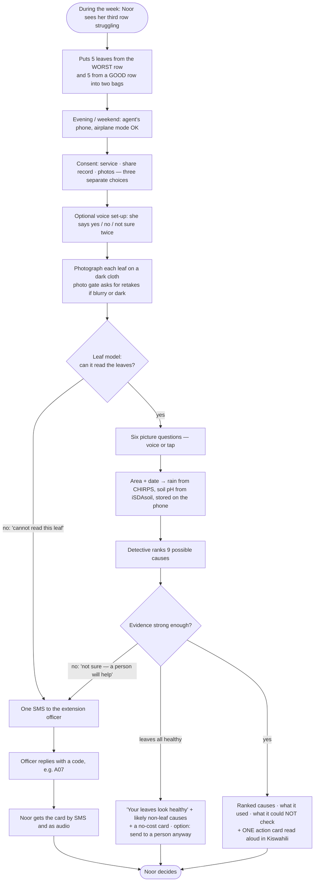
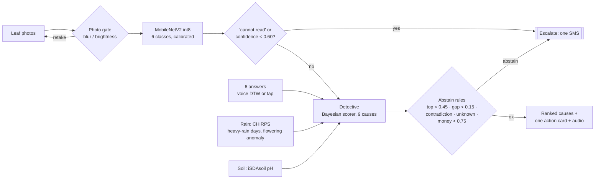
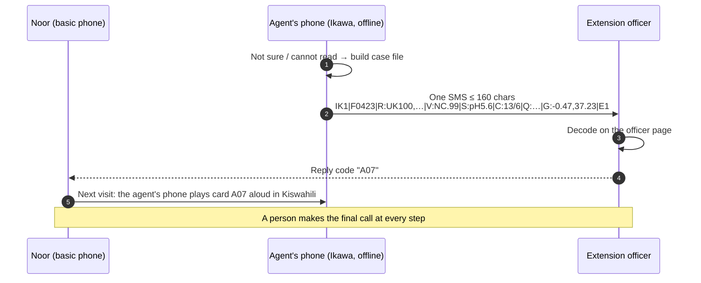
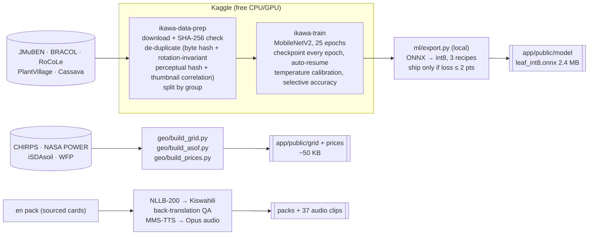
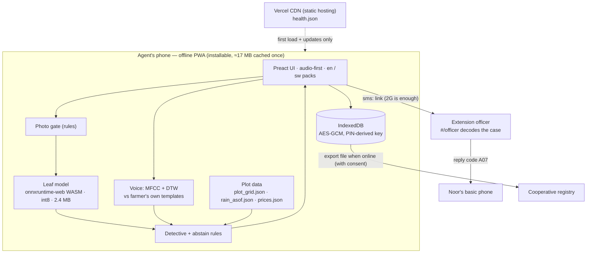
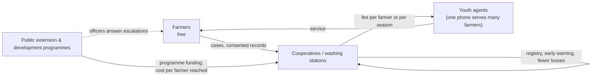

# Ikawa: an offline coffee-farm "yield detective"

Small AI for Development Hackathon · Agriculture track · Hack-Nation × World Bank Youth Summit, 3-4 October 2026

Ikawa helps a smallholder coffee farmer with the question she actually has: *why did my yield drop, and what should I do this week?* Most crop tools only answer "what disease is on this leaf?". Ikawa takes a few leaf photos, the rain and soil data for her area, and her answers to six simple questions. It ranks the likely causes and plays one action card as audio in her language. When the evidence is thin, it says "I cannot read this" or "I'm not sure, a person will help" and packs the case into a single SMS for the extension officer. It runs fully offline on a low-end Android phone, and **a person always makes the final call.**

| | |
|---|---|
| **Live app** | [ikawa-meek-0s-projects.vercel.app](https://ikawa-meek-0s-projects.vercel.app). Works offline after the first visit and can be installed on Android. |
| **Try it in 1 minute** | [Demo: leaf-rust case](https://ikawa-meek-0s-projects.vercel.app/?demo=1) · [Demo: "cannot read this leaf" case](https://ikawa-meek-0s-projects.vercel.app/?demo=1&run=mite) · [all links](#links) |
| **Code** | [github.com/mehedi37/Ikawa](https://github.com/mehedi37/Ikawa) |
| **Setting** | Kirinyaga county, Kenya (Mutira ward, ≈ −0.47°, 37.23°) |
| **Language** | Kiswahili, machine-drafted and not yet checked by a native speaker, with English fallback. Adding a language means adding a pack. |
| **Status** | Deployed working prototype. 102 unit tests and 14 browser tests (including an offline test) pass locally and against the live URL. Lighthouse (mobile): accessibility 100, performance 83. |

> **Noor** is the persona from the hackathon brief: two hectares of coffee, a basic phone that stays at the house while she works the slope, her daughter's smartphone at weekends, and an extension officer who visits "twice a year at best". *Ikawa* means coffee in several East African languages.

<p align="center">
  
  
  
</p>

## Links

**The app.** Open it on a phone for the real experience; on a laptop it renders in a phone-width column.

| What | Link | What you will see |
|---|---|---|
| Live app | [ikawa-meek-0s-projects.vercel.app](https://ikawa-meek-0s-projects.vercel.app) | The PIN screen, then home. On the first visit, choose any PIN of 4 or more digits (it encrypts the data on that device). Later visits on the same device need the same PIN. |
| Demo: leaf-rust case | [`/?demo=1`](https://ikawa-meek-0s-projects.vercel.app/?demo=1) | A scripted case with real leaf photos that ends on a ranked result and one action card |
| Demo: "cannot read" case | [`/?demo=1&run=mite`](https://ikawa-meek-0s-projects.vercel.app/?demo=1&run=mite) | Mite-damaged leaves, then "I cannot read this leaf", then the one-SMS escalation |
| Officer page | [`/#/officer`](https://ikawa-meek-0s-projects.vercel.app/#/officer) | Paste a case SMS, read it decoded, reply with a card code |
| Cooperative page | [`/#/coop`](https://ikawa-meek-0s-projects.vercel.app/#/coop) | Stored cases, storage used, export |
| Health / version | [`/health.json`](https://ikawa-meek-0s-projects.vercel.app/health.json) | Commit, build time, model SHA-256, data versions |

**Project**

| What | Link |
|---|---|
| Source code | [github.com/mehedi37/Ikawa](https://github.com/mehedi37/Ikawa) |
| Video 1: product demo | *link added after upload* |
| Video 2: technical walkthrough | *link added after upload* |
| Measured results (all runs) | [`docs/evidence/README.md`](docs/evidence/README.md) |
| Decision log | [`docs/decisions.md`](docs/decisions.md) |
| Verified problem facts | [`docs/problem-evidence.md`](docs/problem-evidence.md) |
| Slides (PNG) | [`docs/slides/png/`](docs/slides/png/) |

**Data and evidence sources**

| Source | Link |
|---|---|
| JMuBEN (Arabica leaves, Kirinyaga, Kenya) | [Mendeley t2r6rszp5c](https://data.mendeley.com/datasets/t2r6rszp5c/1) |
| JMuBEN2 (healthy and leaf miner) | [Mendeley tgv3zb82nd](https://data.mendeley.com/datasets/tgv3zb82nd/1) |
| BRACOL (Arabica leaves, Brazil) | [Mendeley yy2k5y8mxg](https://data.mendeley.com/datasets/yy2k5y8mxg/1) |
| RoCoLe (Robusta leaves, Ecuador) | [Mendeley c5yvn32dzg](https://data.mendeley.com/datasets/c5yvn32dzg/2) |
| PlantVillage | [Kaggle](https://www.kaggle.com/datasets/abdallahalidev/plantvillage-dataset) |
| Cassava Leaf Disease | [Kaggle competition](https://www.kaggle.com/c/cassava-leaf-disease-classification) |
| CHIRPS daily rainfall | [UCSB Climate Hazards Center](https://www.chc.ucsb.edu/data/chirps) |
| NASA POWER | [power.larc.nasa.gov](https://power.larc.nasa.gov/) |
| iSDAsoil | [isda-africa.com/isdasoil](https://www.isda-africa.com/isdasoil/) |
| WFP food prices, Kenya | [HDX](https://data.humdata.org/dataset/wfp-food-prices-for-kenya) |
| FAOSTAT | [fao.org/faostat](https://www.fao.org/faostat) |
| Kenya Agricultural Sector Extension Policy (2023) | [kilimo.go.ke (PDF)](https://kilimo.go.ke/wp-content/uploads/2024/10/KENYA-AGRICULTURAL-SECTOR-EXTENSION-POLICY-2023.pdf) |

**Models and tools**

| Tool | Link |
|---|---|
| Meta NLLB-200 (translation, used at build time) | [Hugging Face](https://huggingface.co/facebook/nllb-200-distilled-600M) |
| Meta MMS-TTS Kiswahili (speech, used at build time) | [Hugging Face](https://huggingface.co/facebook/mms-tts-swh) |
| ONNX Runtime Web (on-device inference) | [onnxruntime.ai](https://onnxruntime.ai/docs/tutorials/web/) |

The Kaggle notebooks we used for data preparation and training are private. The same scripts are in [`ml/`](ml/) and run unchanged on Kaggle or locally.

**Event**

| | |
|---|---|
| Hack-Nation | [hack-nation.ai](https://hack-nation.ai) |
| World Bank Global AI & Digital Summit 2026 (Seoul) | [worldbank.org event page](https://www.worldbank.org/en/events/2026/10/19/global-ai-and-digital-summit-2026) |

---

## Contents

[Links](#links) · 1. [The problem](#1-the-problem) · 2. [Who it is for](#2-who-it-is-for) · 3. [How it works](#3-how-it-works-the-journey) · 4. [Screenshots](#4-screenshots) · 5. [The AI, and where we chose not to use it](#5-the-ai-and-where-we-chose-not-to-use-it) · 6. [Guardrails](#6-guardrails-and-responsible-ai) · 7. [Results](#7-results-measured) · 8. [Honest limits](#8-honest-limits) · 9. [Data](#9-data) · 10. [Languages](#10-languages-and-localisation) · 11. [How it meets the brief](#11-how-it-meets-the-brief) · 12. [Architecture](#12-architecture) · 13. [Run it](#13-run-it) · 14. [Deployment](#14-deployment-health-and-storage) · 15. [Business model](#15-business-model-why-it-can-last) · 16. [Roadmap](#16-status-and-roadmap) · 17. [Docs map](#17-documentation-map) · 18. [Credits](#18-credits-and-licences)

---

## 1. The problem

> Because of Ikawa, a smallholder coffee farmer in Kirinyaga will identify the most likely cause of her falling yield, and choose one action (or send the case to an extension officer) within the same week she notices the problem, a decision she would otherwise make late or by guesswork; we know because Kenya's coffee yield was 435 kg/ha in 2023 against 592 kg/ha in 2000 (FAOSTAT), and Kenya's 2023 extension policy states that the extension-staff-to-farmer ratio "has not improved" and targets one officer per 600 farmers by 2029.

| Verified fact | Value | Source |
|---|---|---|
| Kenya green-coffee yield | 592 kg/ha (2000) → 262 kg/ha (2010) → 435 kg/ha (2023) | FAOSTAT bulk file, computed by us |
| Coffee area harvested | 160,000 ha (2010) → 111,900 ha (2023) | FAOSTAT |
| Extension coverage | "the ratio of extension staff to farmer has not improved"; target 1 : 600 by 2029 | *Kenya Agricultural Sector Extension Policy*, Dec 2023, p. 8 |

These facts do not prove that missing advice caused the yield to fall. Prices, weather, tree age and disease all matter. They do show why faster, structured decision support is worth building. The details, and the second-hand figures we chose not to use, are in [`docs/problem-evidence.md`](docs/problem-evidence.md).

Most crop apps answer "what is on this leaf?". Noor's question is "why did my yield drop?", and sometimes the most useful answer is "part of this is a normal off-year, so don't buy anything." That is why Ikawa works like a detective rather than a leaf classifier.

## 2. Who it is for

| Person | Device | Role |
|---|---|---|
| **Noor**, the farmer | Basic phone (calls, SMS, mobile money) | Collects leaves, answers questions by voice or tap, gets the result and the officer's reply by SMS, and makes the decision |
| **Agent**: her daughter at weekends, or a cooperative youth agent | Low-end Android smartphone | Runs Ikawa offline: photographs the leaves, plays the questions, shows the result |
| **Extension officer** | Any phone | Receives escalated cases as one SMS and replies with a card code (e.g. `A07`) |
| **Cooperative** | Laptop or phone, occasional internet | Receives consented farmer records, which builds the registry the brief says is missing |

## 3. How it works: the journey



The two bags work as a control group. If the worst-row leaves look no sicker than the good-row leaves, the leaves are probably not the cause, and the detective shifts weight toward soil, rain, old trees or a normal off-year.

## 4. Screenshots

All screenshots were taken from the live site in a 390×844 phone viewport. There are more in [`docs/screenshots/`](docs/screenshots/).

| | | |
|:-:|:-:|:-:|
| <br/>**Home**: area, language, demo runs | <br/>**Two bags**: worst row vs good row | <br/>**Picture questions**: voice or tap |
| <br/>**Result**: ranked causes and one action | <br/>**"I cannot read this leaf"** | <br/>**One SMS** to the officer |
| <br/>**Officer page**: decode, reply | <br/>**Kiswahili** with the machine-drafted badge | <br/>**Coop page**: cases, storage |

## 5. The AI, and where we chose not to use it

Every AI output in Ikawa is a choice from a closed list, with a probability. Below a threshold, the only allowed answer is "not sure, ask a person". Nothing is generated at run time, so there is nothing to hallucinate.

| Part | Technique | What it does | Size / speed |
|---|---|---|---|
| Leaf vision | Computer vision: MobileNetV2, fine-tuned, temperature-calibrated, int8 ONNX | Six classes: `healthy`, `leaf_rust`, `cercospora`, `phoma`, `leaf_miner`, and `not_coffee`, which means "I cannot read this leaf" (not coffee, or a condition outside the five) | 2.4 MB; about 0.27 s per photo on a laptop CPU throttled 4× |
| Voice answers | Pattern recognition: MFCC features and dynamic time warping against the farmer's own recorded words | Recognises yes / no / not sure, with a tap fallback always on screen | No model file (0 MB); works in any language, including unwritten ones |
| The detective | Probabilistic reasoning: a hand-built Bayesian scorer | Combines the leaf results (plus the worst-vs-good contrast), heavy-rain days, flowering-season rain, soil pH and the six answers into probabilities over 9 causes | Instant; every factor can be inspected |
| Abstain rules | Thresholds | Abstains if the photo is unusable, vision confidence is below 0.60, the top cause is below 0.45, the top two are within 0.15, the answers contradict each other, the top cause is `unknown`, or advice that costs money is below 0.75 | n/a |

The 9 causes are leaf rust, other leaf disease, insect pest, heavy-rain damage, drought at flowering, soil acidity or nutrients, old trees needing stumping, a normal off-year, and unknown.



The brief asks whether a simpler tool would do the same job. For these parts it would, so we used one:

| Feature | Tool | Why |
|---|---|---|
| Photo quality | Plain rules (variance of Laplacian, brightness) | Rules are enough |
| Escalation | One SMS, no server | Works on 2G with no data plan |
| Price reference | A plain lookup of WFP maize and bean prices (the WFP files for Kenya and Rwanda contain no coffee price; we checked) | An SMS-level problem deserves an SMS-level tool |
| Advice text | A fixed list of 24 cards written from cited guidance | The tool can only say things that were checked |

AI is needed for what SMS, a spreadsheet or a search can't do: reading a leaf photo, and weighing several possible causes against *her* rain, soil and answers.

## 6. Guardrails and responsible AI

| Concern | What Ikawa does |
|---|---|
| Human in the loop | Ikawa suggests and never acts. Advice that costs money needs at least 0.75 confidence or an officer. |
| Hallucination | Closed lists, pre-recorded audio, and no generated text at run time |
| Fail-safe | Seven abstain rules and the "cannot read this leaf" class lead to one SMS and an officer's reply code |
| Consent | Three separate consents. The photo consent says plainly: "not used yet: this version keeps no photos." |
| Data on the phone | IndexedDB encrypted with AES-GCM (key derived from the agent's PIN via PBKDF2); coordinates rounded to about 1 km; cases deleted only after the agent marks them synced |
| Shared or lost phone | PIN-gated, encrypted storage. We adopted this voluntarily; the question comes from the brief's Health annex. |
| Bias | Trained on Kenyan, Brazilian and Ecuadorian leaves, none of them from Kirinyaga phones, and we say so. Voice matching works per speaker in any language. The registry records the woman farmer in her own name. |
| Language | Machine-drafted Kiswahili is labelled as such in the app and in the videos |



## 7. Results (measured)

Every number here comes from a file in [`docs/evidence/`](docs/evidence/README.md). Nothing was tuned on the held-out sets.

| Run | What changed | In-distribution test | Held-out field clusters (RoCoLe C9-C12) | Unseen mite photos |
|---|---|---|---|---|
| 1 | Baseline (RoCoLe held out entirely) | 98.96 % | **0.0 %**: every field photo labelled "not coffee" (a background shortcut) | 97 % confident, wrong |
| 2 | RoCoLe split by whole field cluster, plus low-res augmentation | 98.44 % | 96.6 % | only 2.6 % flagged |
| **3 (shipped)** | Mite photos taught as "cannot read" | 98.51 % | 89.2 % of all leaves; **96.6 % when it answers**; declines 7.6 % | **50 % flagged** (23/46) |
| 4 | Same as run 3 with EfficientNet-Lite0 (pre-registered comparison) | 98.81 % | 89.7 % | 34.8 % flagged, so not adopted (+0.04 points on validation, below the +0.5 rule written in advance; worse on unknown pests; 50 % larger) |

| Shipped phone model | Value |
|---|---|
| Architecture and format | MobileNetV2-1.0 → ONNX → static int8 (the best of 3 recipes, chosen by measured accuracy) |
| Size | 2.4 MB (fp32: 8.9 MB) |
| Accuracy after int8 | test 98.67 % = fp32 98.67 %; field clusters 88.7 % vs 89.2 %; 98-100 % identical predictions |
| Calibration | ECE 0.019 (test); temperature 0.67 |
| Speed (4× CPU throttle) | model load plus 6 photos 3.1 s; one photo about 0.27 s |
| One-time install | about 17 MB cached for offline use, 13.6 MB of which is the ONNX Runtime WebAssembly engine |

We kept two uncomfortable findings:

1. The most-used coffee leaf dataset is 98 % copies. JMuBEN's 58,550 files collapse to 1,082 independent image groups, and its "healthy" class has only 63 distinct files, each stored about 300 times. A random split would have reported fake accuracy, so we split by group.
2. Our first model got 0 % right on real field photos while scoring 98.96 % on its own test set. We kept that run as evidence and fixed the cause.

The detective is stable where the evidence is clear (no top-cause flips under ±20 % changes to every factor) and unstable where it is ambiguous (40-62 % flips). Those ambiguous cases are where it abstains.

## 8. Honest limits

1. There are no Kenyan phone photos in training. The held-out field clusters share the camera, species (Robusta) and field with the training clusters, so this is a within-dataset test, not a country shift.
2. The model knows five leaf conditions only. Roots, stems, berries and nutrient deficiency are invisible to it, and half of the unseen mite photos are still read as rust.
3. The test sets are small: healthy n = 35 (in-distribution) and 46 unseen mite photos.
4. The detective's multipliers are expert guesses, marked `UNVERIFIED-expert-guess` in [`app/src/engine/priors.ts`](app/src/engine/priors.ts). Only their directions are backed by sources.
5. Rain is a satellite estimate at about 5 km (CHIRPS) and can't see a single slope. Soil values are predicted (iSDAsoil), not lab-measured.
6. The Kiswahili is machine-drafted (Meta NLLB-200 plus manual fixes by a non-native speaker) and unreviewed. The audio comes from Meta MMS-TTS, which has a non-commercial licence.
7. One held-out healthy photo is read as "cannot read" with 0.99 confidence. In a 5-leaf bag it can turn "your leaves look healthy" into "not sure". That is safe, but over-cautious.
8. The nearest WFP market price (Karatina, 11 km away) was last updated in June 2024, and the app flags it as stale.

## 9. Data

| Dataset | Used for | Licence | Size used | Notes |
|---|---|---|---|---|
| JMuBEN + JMuBEN2 (Arabica, Kirinyaga, Kenya) | Training (5 leaf classes) | CC BY 4.0 | 58,550 files → 1,082 groups | 98 % copies; SHA-256-verified downloads from Mendeley |
| BRACOL (Arabica, Brazil) | Training and test | CC BY 4.0 | 1,343 images | The official zip is truncated upstream: 1,402 of 1,747 images are recoverable |
| RoCoLe (Robusta, Ecuador, smartphone, field) | Train C1-7, val C8, held-out C9-12 | CC BY 4.0 | 1,477 images | Mite photos used for "cannot read" and for the abstention test |
| PlantVillage (non-coffee subset) | "cannot read" class | see source | 1,976 | Studio images |
| Cassava Leaf Disease (Kaggle competition) | "cannot read" class | competition terms | 2,000 | Field photos |
| CHIRPS v2.0 daily rain, 0.05° | Heavy-rain days per area and date | see source | 2025 and 2026 (to 31 Aug) | Real events: up to 134 mm in one day somewhere in the study area (28 Apr 2026); 86 mm at the Mutira demo cell in the 90 days to 10 May 2026 |
| NASA POWER | Flowering-season rain anomaly | open | 2015-2026 | About 50 km resolution, too coarse for heavy-rain days |
| iSDAsoil (30 m) | Topsoil pH per area | CC BY 4.0 | 49 points | Predicted values |
| WFP food prices (HDX), Kenya | Maize and bean price card | see source | 46 series within 150 km | Nearest: Karatina (11 km), stale since June 2024 |
| FAOSTAT | Problem evidence | see source | n/a | n/a |

"See source" means we did not re-check the licence ourselves. More detail is in [`docs/data-access.md`](docs/data-access.md).



## 10. Languages and localisation

Each language is one pack: `app/src/content/packs/<lang>.json` holds the 24 action cards, the questions, the consent text and the UI strings, and the audio lives in `app/public/audio/`.

We drafted the Kiswahili with Meta NLLB-200 running locally, checked it by translating it back to English, and fixed the clear errors by hand. "Sick leaves" had become "patients' papers", for example, and "leaf" had become "paper". Every fix is listed in the pack's `manualEdits`, and no string is marked as reviewed.

Adding a language such as Gikuyu (`kik_Latn`) needs no code. Run `ml/translate_content.py` or `ml/translate_missing.py`, render the audio with `audio/render.py` (Meta MMS-TTS supports `kik`), and add the language to the switcher. Voice answers already work in any language.

[`docs/review/`](docs/review/) has every string with the safety-critical lines first, plus a message to send to a volunteer reviewer.

## 11. How it meets the brief

| Rule in the brief (§06 and Annex B) | How Ikawa meets it |
|---|---|
| Runs on a device the user already has | A low-end Android phone (agent or daughter), plus Noor's basic phone by SMS |
| Core feature works offline | The model, rain/soil grid, detective and audio are all on the phone; [`app/e2e/offline.spec.ts`](app/e2e/offline.spec.ts) tests this |
| Model small enough to side-load or send over a weak link | 2.4 MB model; data and audio under 1 MB |
| At least one interaction in a named local language | Kiswahili: audio questions, audio action cards, SMS text |
| "How would it fare in a less-supported language?" | Voice templates need no language data, packs are files, and Gikuyu is the next pack |
| A person makes the final call, and the tool flags what it is unsure of | Suggest-only; probabilities; "what I could not check"; abstain rules |
| Avoid hallucinations | Closed lists, pre-recorded audio |
| Cite data and state what the data does not cover | §9 and §8 |
| Help Noor make or act on one better agricultural decision | Identifies a crop problem, times an action, gives localised advice, documents an observation, and connects to the extension next step |
| Precondition: a farmer registry | Each consented case creates a registry record in the woman farmer's own name |

## 12. Architecture



```
app/            PWA: src/screens · src/engine (vision, detective, priors, voice, smscodec, photogate)
                src/lib (analyze, plot, voicecodec) · src/content/packs (en, sw) · src/store (encrypted IndexedDB)
                e2e/ (Playwright) · public/ (model, grid, prices, audio, img, demo)
ml/             prepare_data.py · train.py · export.py · translate_content.py · translate_missing.py · kaggle/
geo/            build_grid.py · build_asof.py · build_prices.py · test_geo.py
detective/      vignettes.json (30 SYNTHETIC test cases)        audio/  render.py (MMS-TTS → Opus)
data/scripts/   fetch_open_data.py            scripts/  healthcheck.sh
docs/           evidence · decisions · problem evidence · contracts · slides · screenshots · review kit
```

Stack: TypeScript, Preact, Vite, vite-plugin-pwa (Workbox), onnxruntime-web, Meyda, idb, WebCrypto · Python, PyTorch, timm, ONNX Runtime quantisation, rasterio, NLLB-200, MMS-TTS · Kaggle kernels · Vitest, Playwright · Vercel.

## 13. Run it

### The app

```bash
cd app
npm install
npm run dev                      # http://localhost:5173   demo: /?demo=1   cannot-read demo: /?demo=1&run=mite
npm test                         # 102 unit tests (vitest)
npm run typecheck                # app + tests
npx playwright install chromium  # once
npx playwright test              # 14 browser tests, incl. the offline proof
LIVE_URL=https://ikawa-meek-0s-projects.vercel.app npx playwright test -c playwright.live.config.ts   # same tests against the live site
npm run build && npm run size    # production build + size budget check
```

Routes: `#/officer` decodes a case SMS and replies with a card code; `#/coop` shows stored cases and storage, and exports them.

### Rebuild the data and the model (optional)

```bash
uv sync
uv run python data/scripts/fetch_open_data.py             # CHIRPS, NASA POWER, iSDAsoil, WFP, FAOSTAT (idempotent)
uv run python geo/build_grid.py && uv run python geo/build_asof.py && uv run python geo/build_prices.py

# Kaggle (needs KAGGLE_API_TOKEN in a git-ignored .env)
ml/kaggle/push.sh data-prep      # download + verify + de-duplicate + split → images.tar + manifest.csv
ml/kaggle/push.sh train          # MobileNetV2, 25 epochs, checkpoint every epoch, auto-resume

# Phone model (needs torch, timm, onnx, onnxruntime)
python ml/export.py --run <train output> --data <data-prep output> --out app/public/model --calib 100
```

Training survives crashes. `last.pt` is written atomically after every epoch and on SIGTERM, the last three epochs are kept, and `--resume auto` continues from the newest readable checkpoint. In a hard-kill test the run lost at most one epoch, and the resumed run reproduced identical numbers.

## 14. Deployment, health and storage

The app is live at https://ikawa-meek-0s-projects.vercel.app (Vercel). Note that `ikawa.vercel.app` belongs to someone else.

Ikawa is a static PWA with no backend, no database and no API keys at run time. It only needs HTTPS, because the camera, microphone, GPS and service worker all require a secure context.

| | Vercel (live) | Render (optional mirror, not deployed) |
|---|---|---|
| Config | [`app/vercel.json`](app/vercel.json) and [`app/.vercelignore`](app/.vercelignore) | [`render.yaml`](render.yaml) (Blueprint, static site) |
| Build | root `app` · `npm ci` · `npm run build` · output `dist` | same |
| Headers | `sw.js`, `registerSW.js` and `manifest.webmanifest` get `no-cache` (so updates reach phones) · `health.json` gets `no-store` · `/assets/*` is immutable · `Permissions-Policy` for camera, mic and GPS · `nosniff` · `no-referrer` | same |

```bash
cd app && vercel deploy --prod --yes --build-env GIT_COMMIT=$(git rev-parse --short HEAD)
../scripts/healthcheck.sh https://ikawa-meek-0s-projects.vercel.app      # exit 0 = healthy
```

`GET /health.json` returns the commit, build time, model file and SHA-256, data versions and language-pack status. It is written after the build, so the offline cache never serves a stale copy. [`scripts/healthcheck.sh`](scripts/healthcheck.sh) checks the page, `health.json`, the model, the grids and the service worker, and confirms that the WebAssembly engine is served as `application/wasm`. You don't need a keep-alive cron job: static hosting on Vercel's CDN (or a Render static site) never sleeps. Only server processes spin down, and Ikawa has none.

The app does not grow on the phone over time. It stores no photos, and the model never changes on the device.

| What | Size | Grows? |
|---|---|---|
| Offline cache (app, model, engine, grids, audio) | about 17 MB | No. It is fixed per release; a new deploy replaces changed files and deletes old caches. |
| Each case (causes, answers, area; encrypted) | about 1-2 KB | Until the agent marks it synced and deletes it on the Coop page |
| Each farmer's voice templates (numbers, not audio) | about 42 KB (was 150 KB) | Once per farmer |
| Photos | 0 | Never stored |

## 15. Business model: why it can last



Farmers use Ikawa for free. The people who benefit from scale pay for it. Cooperatives get a farmer registry, earlier warning of disease and better-quality cherries. Public extension and development programmes reach farmers at a cost per farmer far below a physical visit.

One trained youth agent with one phone can serve many farmers, which fits the brief's youth-employment theme. Running costs stay low because there are no servers and no cloud AI; the main cost is people (agents and officers), which suits a development tool.

The approach carries over to new settings. A new crop means retraining the leaf model on the same pipeline, a new region means rebuilding the rain and soil grid, and a new language means a new pack. The full business plan was written before the build and is partly superseded: [`docs/business-plan.md`](docs/business-plan.md).

## 16. Status and roadmap

Done so far: the data pipeline, 4 training runs with evidence, the int8 phone model, the detective and abstain rules, voice templates, the SMS codec, the encrypted store, the Kirinyaga rain and soil grid with per-date history, Kenyan market prices, the Kiswahili pack with 37 audio clips, licensed pictures, the offline test, the "leaves look healthy" state, demo mode, and deployment with a health check.

Next:

- Native-speaker review of the Kiswahili, and a Gikuyu pack
- Kenyan phone photos from a partner cooperative (with consent), then retrain and re-test
- A 7th `other_damage` class and an out-of-distribution score, to catch the mites that still get through
- Agronomist review of every detective factor, replacing the `UNVERIFIED` values
- A smaller runtime (a custom minimal ONNX Runtime build or WebNN), and optionally multi-threaded WASM
- Re-using saved voice templates on a farmer's next visit
- Registry export into existing systems, and an aggregated "rust radar" early-warning map

## 17. Documentation map

| File | What |
|---|---|
| [`docs/evidence/README.md`](docs/evidence/README.md) | Measured results of every run |
| [`docs/decisions.md`](docs/decisions.md) | Decision log D-001 to D-032, with reasons and rejected options |
| [`docs/problem-evidence.md`](docs/problem-evidence.md) | Verified problem facts and the problem statement |
| [`docs/contracts.md`](docs/contracts.md) | Locked interfaces between modules |
| [`docs/build-details.md`](docs/build-details.md) · [`docs/business-plan.md`](docs/business-plan.md) · [`docs/tech-stack.md`](docs/tech-stack.md) | Original design, business plan and stack (partly superseded; see the banners) |
| [`docs/data-access.md`](docs/data-access.md) · [`docs/content-sources.md`](docs/content-sources.md) · [`docs/ATTRIBUTIONS.md`](docs/ATTRIBUTIONS.md) | Data access, advice sources, image credits |
| [`docs/slides/`](docs/slides/) · [`docs/screenshots/`](docs/screenshots/) · [`docs/review/`](docs/review/) | Video slides, live screenshots, native-review kit |
| [`app/qa/REPORT.md`](app/qa/REPORT.md) | Browser QA report |

## 18. Credits and licences

Datasets: JMuBEN/JMuBEN2, BRACOL and RoCoLe (CC BY 4.0, Mendeley Data); PlantVillage; Cassava Leaf Disease (Kaggle); CHIRPS (UCSB Climate Hazards Center); NASA POWER; iSDAsoil; WFP via HDX; FAOSTAT.

Models: MobileNetV2 ImageNet weights via `timm`; Meta NLLB-200 and Meta MMS-TTS. Both Meta models are licensed CC BY-NC 4.0, so we use them only in this non-commercial prototype. A commercial deployment would need native recordings and another translation path.

Images: antestia nymphs (Smartse) and coffee berry-borer damage (L. Shyamal), from Wikimedia Commons under CC BY-SA 3.0. See [`docs/ATTRIBUTIONS.md`](docs/ATTRIBUTIONS.md). The leaf-photo guide is our own drawing.

Brief: the *Small AI for Development* concept note by the World Bank Group Digital & AI Vice Presidency, the Youth Summit and Hack-Nation (not redistributed here).

Built by a one-person team, with Claude Code (Anthropic) as a coding assistant.
